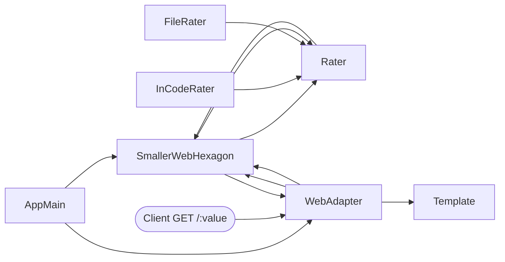

# SmallerWebHexagon — Architecture Diagram

This file contains a simple Mermaid diagram visualizing the hexagonal architecture of the app.

Quick notes
- Core domain: `SmallerWebHexagon` (pure business logic) depends on the `Rater` port.
- Outbound adapters: `InCodeRater`, `FileRater` implement `Rater` and provide rating strategies.
- Inbound adapter: `WebAdapter` exposes an HTTP API using Spark and renders `templates/result_view.html`.
- `AppMain` composes the application (chooses a `Rater` impl and starts the web adapter).

Open file: [.github/architecture/diagram.md](.github/architecture/diagram.md)
